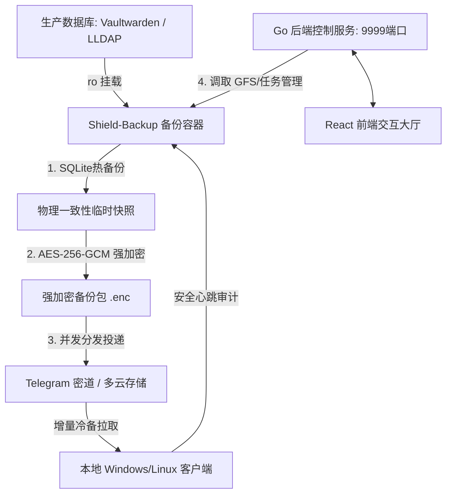

# Shield-Backup: 去中心化强加密灾备一体解决方案

`Shield-Backup` 是一款集成了 **“高频一致性物理备份守护”** 与 **“现代化 React 交互控制面板大厅”** 的高级分布式灾备中心，主要针对Docker备份场景进行开发。系统采用源端强加密策略，支持多云盘（OneDrive、Google Drive、PikPak）及 Telegram 密道的去中心化双轨分发。在极端物理损毁时，通过单个轻量脚本可在新宿主机上一秒离线重建。

---

## 🌟 核心特性

- 🖥️ **可视化监控大厅**：采用 Go 后端 + React (TypeScript) 前端，包含主/子任务进程追踪、大厅速率与 ETA 实时同步。
- ⏳ **细粒度分类导出与还原**：支持对存储池配置（rclone）、冷备拉取清单、本地加密主密码、GFS 规则、常规系统设置、历史日志及服务器备份列表等 8 个独立模块进行多选局部打包和级联合并还原。
- 🔬 **安全沙箱一致性自检**：备份包在云端分发前，系统会自动在本地安全沙箱容器中执行静默还原、Tar 结构解压与 SQLite 数据库语法/完整性（Integrity Check）自愈检测，若未通过则立即熔断分发并发送 TG 警报。
- 🗂️ **多存储池下载负载均衡（自愈拉回）**：在新搭建或缺失本地物理快照的环境中，系统会并发扫描所有可用云盘，通过**最小负载均摊算法**将缺失文件分流指派到不同存储池，均摊并发拉回。
- 💻 **本地物理冷备份审计**：客户端（Windows/Linux）通过安全 Token 执行增量冷备拉取，其同步流水实时上报控制大厅并被独立持久化审计。

---

## 🏗️ 系统架构图



---

## 📂 项目工程目录说明

```text
├── config/              # 运行时配置文件目录 (包含 rclone.conf、settings.json 等，Git 自动忽略)
├── server/              # Go 语言控制中心服务端源码 (任务生命周期、API 控制器、GFS 计算)
├── web/                 # React (Vite + TS + Tailwind) 可视化大厅前端源码
├── backup.sh            # 容器内运行的备份守护核心脚本
├── compose.yaml         # Docker Compose 生产一键拉起配置文件
├── decrypt_local.ps1    # 本地 Windows 物理冷备强解密工具脚本
├── sync_to_local.ps1    # 本地 Windows 物理增量冷备拉取工具脚本
├── restore.sh           # 去中心化一键灾难恢复主脚本 (宿主机无大厅直接恢复)
└── restore_system.sh    # 全系统配置一键灾难恢复子脚本
```

---

## 🚀 快速开始与部署说明

### 1. 本地开发与调试

#### 前端 Web 启动：
```bash
cd web
npm install
npm run dev
```

#### 后端 Go 服务启动：
```bash
cd server
# 请确保已在本地 /config 目录下创建了基础配置文件
go run main.go
```

---

### 2. 生产环境 Docker-Compose 部署

#### 准备配置（物理脱敏防护）：
在部署目录的 `config/` 下配置您的 `rclone.conf` 存储凭证。并在宿主机上配置您的 `.env` 环境变量，定义如下核心参数：
```env
BACKUP_PASSWORD=你的AES对称加密强密码
TELEGRAM_BOT_TOKEN=你的Telegram机器人Token
TELEGRAM_CHAT_ID=你的Telegram接收频道ID
```

#### 一键 Compose 拉起：
```bash
docker compose up -d --build
```
服务将在容器内编译并自动在宿主机映射的 **`9999`** 端口上拉起可视化大厅。

---

### 3. 本地 Windows 冷备份助手设置

1. 将 [sync_to_local.ps1](sync_to_local.ps1) 拷贝到您的本地 PC 硬盘目录。
2. 打开脚本，配置您大厅面板中的 `DownloadToken` 鉴权密钥以及云盘名称。
3. 将此脚本加入 Windows 定时任务（Task Scheduler），设置为每日或每周自动运行，实现增量冷备份物理隔离。
4. 如需在本地解开备份包，直接右键运行 [decrypt_local.ps1](decrypt_local.ps1)，输入您的主解密密码即可一键还原为可读的 SQLite 数据库文件。

---

## 🔒 安全红线与数据隐私

- **源端加密**：所有备份包在离开 VPS 服务器之前，均已完成了 AES-256 高强度对称加密（对于 Telegram 发送包）或通过 Rclone Crypt 进行了底层文件名及内容流式加密，云端服务商和任何外界第三方均无法读取数据。
- **只读特权**：容器对生产 stacks 数据的挂载可被物理强制为 `:ro` (只读)。在容器物理层面上阻止了备份进程因代码异常或受侵入导致毁坏生产数据的可能。
