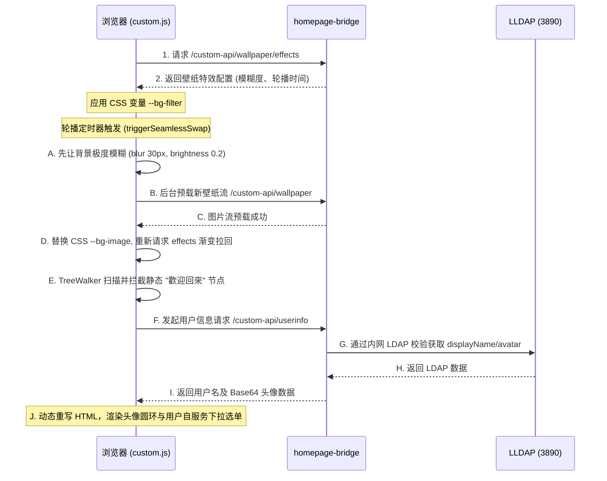

# Homepage 导航面板与动态美化服务说明 (Homepage & Aesthetics Integration)

[Homepage](file:///d:/Work_Project/VPS_RN/vps_knowledge/services/homepage.md) 是整个 VPS 私有云系统的视觉中枢和主控导航台。它不仅聚合展示了所有部署的服务卡片，还通过与 `homepage-bridge` 的深度对接，实现了高度定制化的动态壁纸引擎与用户自服务中心。

---

## 📂 部署与物理路径对照

* **宿主机部署 Stack 目录**：`/opt/stacks/homepage/` (核心文件：`compose.yaml`, `.env`)
* **持久化配置挂载目录**：`/opt/homepage/config` (映射到容器内的 `/app/config`)
* **网络配置**：接入共享外部网络 `proxy`，受 Traefik HTTPS 网关反代与 Authelia SSO 保护。
* **访问域名**：`https://xxxiong.top` 或 `https://dashboard.xxxiong.top`

---

## 🎨 页面美化与卡片样式设计 (custom.css)

用户在 `/opt/homepage/config/custom.css` 中注入了大量定制化的毛玻璃（Glassmorphism）和悬停动画样式。关键样式逻辑归纳如下：

### 1. 磨砂玻璃卡片背景
所有的卡片（`.service-card` 与 `.widget`）均被剥离了纯色背景，强制转换为高饱和度的毛玻璃特效：
```css
body, #__next, main {
    background-color: transparent !important;
    background-image: none !important;
}
/* 磨砂玻璃核心实现 */
.service-card, .widget {
    background: rgba(255, 255, 255, 0.03) !important;
    backdrop-filter: blur(5px) saturate(150%) !important;
    -webkit-backdrop-filter: blur(5px) saturate(150%) !important;
}
```

### 2. 悬停交互动效 (Hover Effects)
当鼠标悬浮在卡片上时，卡片会在 0.5 秒内平滑上浮 8px，并伴随阴影扩散与高光提亮：
```css
.service:hover .service-card, .widget:hover {
    transform: translateY(-8px) !important;
    box-shadow: 0 40px 120px rgba(0, 0, 0, 0.08), 0 10px 30px rgba(0, 0, 0, 0.03) !important;
}
```

### 3. 折叠面板展开/收起闪烁消除
为了消除 React 动态展开卡片组（`headlessui-disclosure-panel`）时的闪烁与重影，CSS 强行对折叠状态下的子内容和毛玻璃伪元素进行了透明度归零处理：
* **折叠时**：卡片下移 20px，文字与伪元素透明度设为 `0` (快速消散)。
* **展开时**：在 0.4 秒内平滑恢复透明度，形成平滑拉伸淡入效果。

---

## 🌌 与 homepage-bridge 动态特效引擎联动 (custom.js)

这是全系统**最核心、最复杂的动态联动机制**。它由浏览器端加载的 `/opt/homepage/config/custom.js` 异步调用 `homepage-bridge` 的 API 实现：



### 1. 电影级动态壁纸无缝转场引擎
* **特效注入**：`custom.js` 加载时自动读取 `/custom-api/wallpaper/effects`，将后端的模糊度（`blur`）与亮度（`brightness`）写入页面的 CSS 变量 `--bg-filter`；将背景图片写入 `--bg-image`。
* **无缝切图算法 (`triggerSeamlessSwap`)**：
  * 当定时器判定需要轮播切图时，**并不直接更换壁纸**（以防白屏闪烁）。
  * 步骤 A：JS 首先将当前背景特效设为极度模糊与暗化（`blur(30px) brightness(0.2)`），在 1.2 秒内产生一个深邃渐变的转场过渡。
  * 步骤 B：使用 `new Image()` 在后台静默预载下张图片 `/custom-api/wallpaper?t=xxx`。
  * 步骤 C：预载成功后，瞬间替换 `--bg-image` 变量，并重新调用 `loadWallpaperEffects()`。由于新壁纸的 `effects` 模糊度较低，背景会自然地从极度模糊状态“淡入”变清晰，达成电影级的无缝丝滑过渡。

### 2. 头像注入与用户自服务中心 (Welcome Banner Hijacking)
* **节点劫持**：由于 Homepage 原生不支持显示 LDAP 用户头像，`custom.js` 在页面载入后启动 `TreeWalker`，扫描并劫持包含“歡迎回來”的静态 React 文本节点。
* **信息拉取**：JS 阻断该节点，向 `homepage-bridge` 的 `/custom-api/userinfo` 接口请求数据。该接口受 Authelia 网关保护，bridge 从 Authelia 的 Header（`Remote-User`）得知当前登录的 root 用户，进而在内网向 `lldap:3890` 查询该账户的 `displayName` 与 Base64 格式的头像。
* **DOM 重写与菜单渲染**：
  * 清空原本的“歡迎回來”文本，动态注入 Flex 布局的头像圆环与用户真实 displayName。
  * 头像绑定了 Click 事件。点击后会弹出一个美化的下拉菜单，提供以下联动跳转：
    1. **修改个人资料** (指向 `https://xxxiong.top/profile`，由 bridge 提供前端模板)
    2. **修改登录密码** (指向 `https://xxxiong.top/password`，用户在此输入的密码将由 bridge 通过内网 LDAP 修改 LLDAP 数据库，热更新全局凭证)
    3. **背景壁纸管理** (指向 `https://xxxiong.top/wallpaper`，允许用户在此上传、删除壁纸，调整单张壁纸的缩放、模糊与亮度特效并即时应用到主页)

---

## ⚙️ 核心配置文件解析

### 1. [services.yaml](file:///d:/Work_Project/VPS_RN/vps_knowledge/services/homepage.md#L67-L112) (卡片内网直连配置)
为了防止 Homepage widget 拉取数据时因没有 Authelia SSO 凭证而被拦截，Widget 必须绕过公网 Traefik，使用 **Docker 内部网络直连**：
* **Portainer 卡片**：`url: http://portainer:9000` (绕过 SSO)；传入 API Key 后即可拉取容器健康指标。
* **Netdata 卡片**：`url: http://netdata:19999` (绕过 SSO)；用于在主页拉取服务器实时性能数据。

### 2. [settings.yaml](file:///d:/Work_Project/VPS_RN/vps_knowledge/services/homepage.md#L28-L51) (布局外观)
* 语言设为 `zh-TW`。
* 隐藏分类底线 (`headerStyle: clean`)，并开启卡片等高 (`useEqualHeights: true`)。
* 状态指示灯设为极简圆点 (`statusStyle: "dot"`)。
